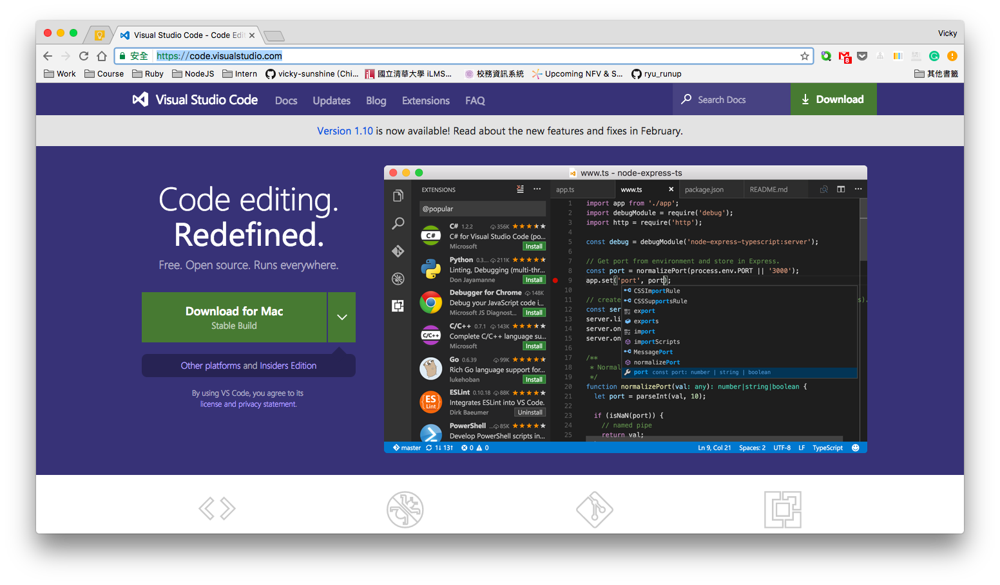

# 0 - 環境建置
作業系統 Windows 10 (準備踩雷囉！)

## 安裝 Terminal (Git Bash)
開發 Rails 蠻仰賴命令列輸入的，而 Windows 內建的命令列功能沒有很完整，所以我們需要一個有最基本功能的命令列工具。Git 是一套版本控管套件，可以方便開發者記錄自己的進度，Git Bash 是他提供的命令列工具，支援 Git 指令還有基本的 *nix 指令。

### 安裝 Git Bash
到 [Git 下載網頁](https://git-scm.com/downloads) 選擇 Windows 版本下載，下載下來後，初心者基本上就只要接受他預設設定，一直按下一步即可。

完成後，可以在開始工具列看到 Git Bash 的選項，也可以在特定資料夾下，按右鍵開啟。


開啟後，長下列樣子


### 基本指令
這邊我們先不教 Git 指令，先列出一些常用的 *nix 指令。
```shell
$ cd folder	# 打開某資料夾
$ cd ..		# 到上一層資料夾
$ pwd		# 列出當前路徑
$ ls		# 列出這個資料夾下有的資料夾或檔案
$ cat file	# 查看某個檔案內容
$ mkdir	folder	# 創新資料夾
$ rm file	# 刪除某個檔案
```


## 安裝 Ruby, Rails, Git 和一些網站開發套件
### 安裝 Ruby
Windows 沒有內建 Ruby 和 Rails，所以我們需要另行安裝，在 Windows 的系統上，有一個很方便的安裝包，叫做 [Ruby Installer](http://rubyinstaller.org/downloads/)，我們下載 Ruby 2.3.3 (x64) 安裝檔

基本上就是一直下一步，要注意到安裝前最後一步時，會有三個選項


要把 `Add Ruby excutables to your PATH` 和 `Associate .rb and .rbw files with this Ruby installation`這兩個選項打勾。

裝完後，可以利用 Windows 的命令列提示字元，確定有沒有安裝成功。(找不到的話請搜尋`cmd`)

請在 Git Bash 裡打上以下指令(`$`字號代表要在命令列裡輸入的意思)
```shell
$ ruby -v
ruby 2.3.3p222 (2016-11-21 revision 56859) [x64-mingw32]
```
若有出現 ruby 版本號，就代表安裝成功。

### 安裝 Devkit
跟 [Ruby Installer](http://rubyinstaller.org/downloads/) 同個網頁的下方，有個 Development Kit。


因為我們裝的是 Ruby 2.3.3，所以就下載適用 Ruby 2.0 以上的 DevKit。

下載下來後，請解壓縮你認得的地方，因為我們要在命令列裡輸入，譬如我是解壓縮到 `C:\Users\vicky\Downloads`，在 Git Bash 裡則會轉換到 `/c/Users/vicky/Downloads`，要透過 `cd` 指令慢慢切換。 (比較簡單的方法是：在你解壓縮的資料夾裡，右鍵開啟 Git Bash)

確定命令列已經到解壓縮資料夾後，下
```
$ ruby dk.rb init
```
這可以偵測出你安裝的 Ruby 版本，它會產生出一個 `config.yml` 檔案，我們使用 `cat` 來查看。

``` shell
$ cat config.yml
# This configuration file contains the absolute path locations of all
# installed Rubies to be enhanced to work with the DevKit. This config
# file is generated by the 'ruby dk.rb init' step and may be modified
# before running the 'ruby dk.rb install' step. To include any installed
# Rubies that were not automagically discovered, simply add a line below
# the triple hyphens with the absolute path to the Ruby root directory.
#
# Example:
#
# ---
# - C:/ruby19trunk
# - C:/ruby192dev
#
---
- C:/Ruby23-x64

```
確定版本對後，就繼續下指令來安裝：
```shell
$ ruby dk.rb install
```

### 安裝 Rails

```shell
$ gem install sqlite3 --no-ri --no-rdoc
$ gem install rails --no-ri --no-rdoc
```

安裝完後
```
$ rails -v
Rails 5.0.2
```
就可以確定完成。


## 安裝編輯器 VS Code
編輯器顧名思義就是你可以用來編輯檔案的地方，我是都拿來寫程式或相關的文件檔，你也可以用來打一般 txt 文字檔。

### VS Code
去 [VS Code]() 官網下載，右上角有 Download 鍵


下載下來執行後，就一直下一步，只是到下圖這一步要注意，記得把前兩個 `[以 Code 開啟]` 選項打開。（這方便之後你可以用命令列快捷鍵打開。）


接下來，你只要利用 Git Bash 切到想要開啟編輯器的資料夾，打上
```
code .
```
就可以開啟 VS Code，當然也可以在那個資料夾下右鍵選單開啟。