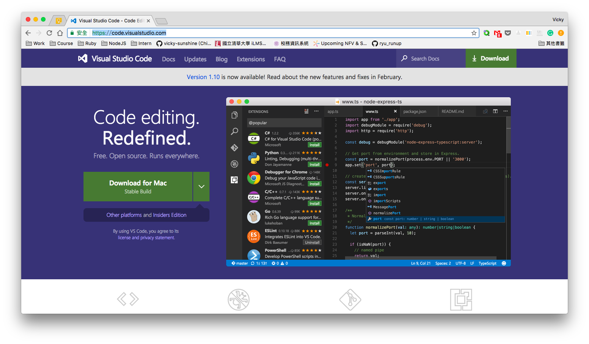
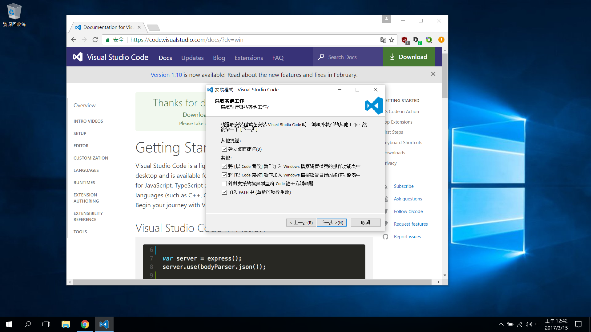

# 0 - 環境建置
作業系統 Windows 10 (準備踩雷囉！)

## 安裝 Terminal

## 安裝 Ruby, Rails, Git 和一些網站開發套件
### Ruby
Windows 沒有內建 Ruby 和 Rails，所以我們需要另行安裝，在 Windows 的系統上，有一個很方便的安裝包，叫做 [Ruby Installer](http://rubyinstaller.org/downloads/) 下載 Ruby 2.3.3 (x64) 安裝檔

### Devkit

## 安裝編輯器 VS Code
編輯器顧名思義就是你可以用來編輯檔案的地方，我是都拿來寫程式或相關的文件檔，你也可以用來打一般 txt 文字檔。

### VS Code
去 [VS Code]() 官網下載，右上角有 Download 鍵

下載下來執行後，就一直下一步，只是到下圖這一步要注意，記得把前兩個 `[以 Code 開啟]` 選項打開。（這方便之後你可以用命令列快捷鍵打開。）

### Ruby 相關套件

### 其它套件

## 安裝 Git